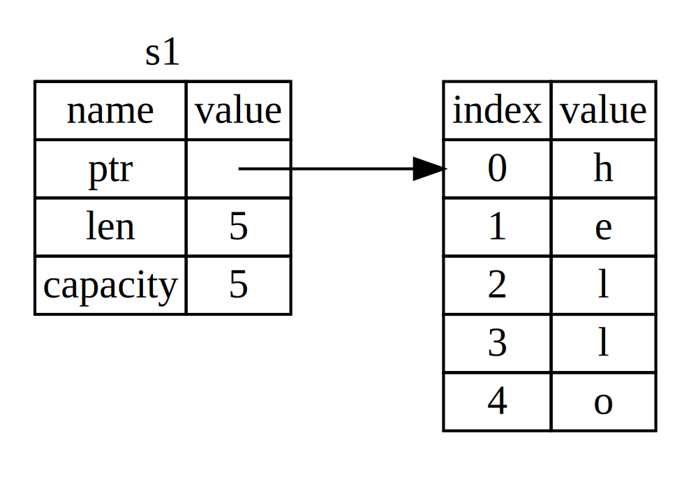
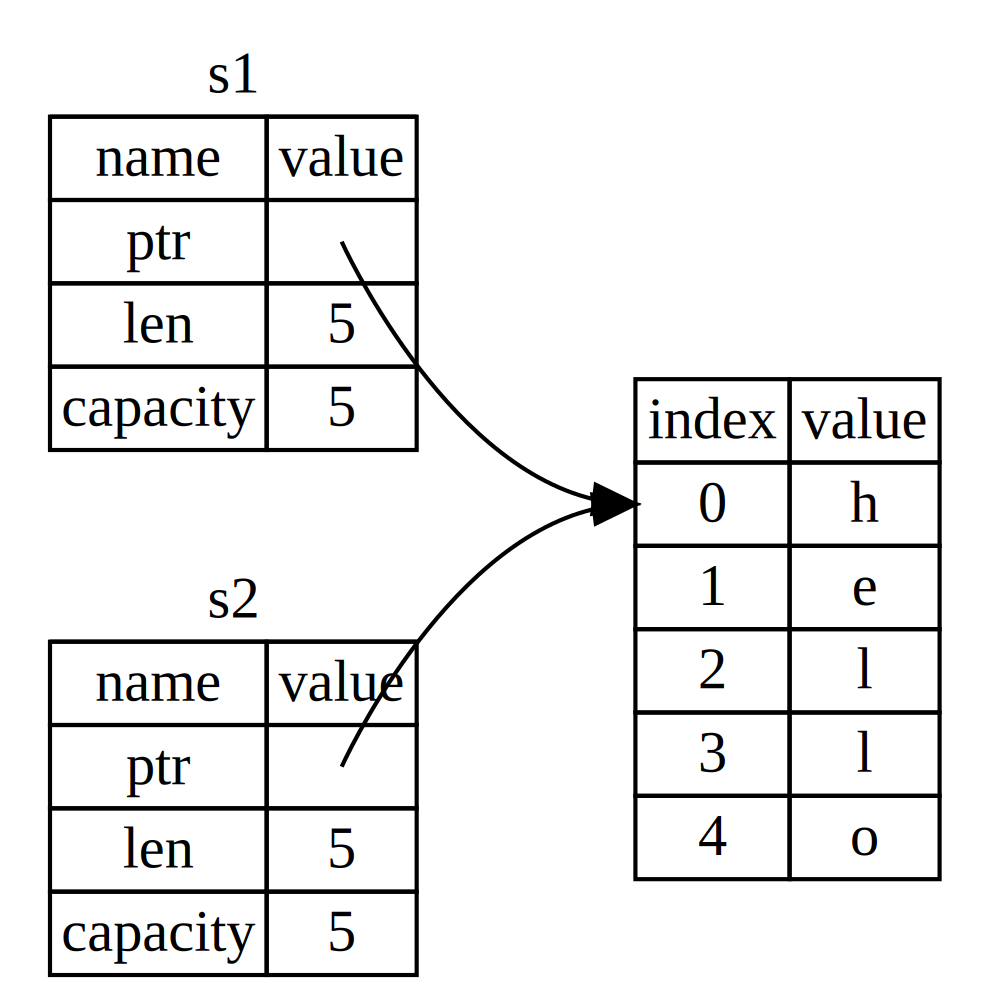

# 所有权

所有权是 Rust 最为独特的核心功能，它使 Rust 无需垃圾回收器即可保证内存安全。因此，理解所有权的工作机制非常重要。

与所有权相关的特性包括：借用、分片以及 Rust 的内存分配。

## 所有权 vs 堆、栈

栈按照顺序存储管理数据，LIFO（后进先出）。数据入栈（pushing onto the stack），数据出栈（popping off the stack）。栈只用于存储具有已知确切大小的数据，编译时大小不确定或者在运行期间大小可能发生变化的数据则必须使用堆来存放。

将数据存放到堆上时，需要请求一定数量的空间，操作系统会在堆上找到足够大的空闲位置将其标记为已使用，并返回一个指针（内存地址），这个过程叫做分配。将数据存储到栈则不被认为是分配。同时由于指针是已知确定大小的，因此可以存储到栈中，当需要访问实际存放的数据时，必须通过指针进一步获取。

数据入栈速度快于在堆上分配，因为操作系统不需要为存放新数据而进行空间查找，这个位置永远是栈的顶部。相较而言，堆上分配需要操作系统处理更多的工作才能完成（找到足够大的空间用于存放数据、记录空间分配信息为下一次分配作准备）

由于需要通过指针进行间接处理，访问堆数据要慢于访问栈数据。对大量堆上空间进行分配同样会耗费时间。

当代码进行函数调用时，值被传入函数中进行处理（可能包含指向堆数据的指针），函数本地变量被推入栈中，当函数执行结束，这些值将从栈中被弹出。

跟踪代码使用堆数据的情况（哪些代码使用了堆上的哪些数据）、减少堆上重复数据的数量，以及清理不再使用的数据防止内存空间耗尽，这些都属于所有权系统要处理的问题。一旦理解了所有权，知道所有权存在的目的就是为了管理堆数据，这能够帮助解释其运行机制，也就不再需要过多考虑堆和栈了。

## 所有权规则

- 每个值都有一个被称之为其所有者（ owner ）的变量
- 任意时候，值有且只有一个所有者
- 当所有者（ 变量 ）离开作用域，其对应的值将被自动丢弃

## 变量作用域

```rust
{ // 作用域开始，变量 s 尚未声明
    let s = "hello";   // 变量 s 有效
    // 对 s 进行操作
} // 作用域结束，s 不再有效
```

## `String` 类型

### 字符串字面量

```rust
let s = "hello";
```

使用时被硬编码进程序，字面值使用方便，但不是在任何场景下都适用，原因如下：

- 字符串值是不可变的
- 无法保证编译时确切知道所有字符串的值（ 例如运行时的用户输入 ）

### 字符串类型 `String`

`String` 类型被分配到堆上，能够存储在编译时不确定长度的文本

```rust
// 使用 `from` 函数基于字符串字面值来创建 `String`
let s = String::from("hello");
let mut s = String::from("hello");

s.push_str(", world!"); // 运行 push_str() 方法追加字面值
println!("{}", s); // 将打印 `hello, world!`
```

字符串字面值不可变而 `String` 类型可变的原因在于它们使用内存的方式不同。选择使用 `String` 类型而不是字符串字面量有助于更好地理解所有权。

## 内存与分配

字符串字面值使用起来快速且高效，得益于其不可变性。因为字符串字面值在编译时内容已知，文本可被直接硬编码进最终的可执行文件中。

但是，不能为了存储编译时大小未知的文本而将一整块内存放入二进制文件中，况且其大小还可能随着程序运行发生变化。

为了支持可变的文本，需要在堆上分配一块在编译时大小未知的内存来存放内容，这意味着：

- 必须在运行时向操作系统请求内存
- 需要一个方法，在处理完 `String` 时将内存归还给操作系统

### 不同编程语言的内存管理

1、有垃圾回收机制的语言

GC 机制负责记录并清除不再使用的内存，程序员只负责申请使用内存

2、无垃圾回收机制的语言

程序员需要负责：

- 编写代码请求内存
- 识别不再使用的内存
- 编写用于释放内存的代码并显式调用

正确的分配释放内存历来都是一个编程难题，如果忘记回收会浪费内存，如果过早回收，会出现无效变量。如果重复回收，也会造成 BUG。因此，在编程过程中需要异常谨慎处理每一次的内存分配和释放。

3、Rust

Rust 采用了与其他语言不同的路线，通过所有权系统对内存进行管理，编译器在编译期间对所有权规则进行检查，**内存在拥有它的变量离开作用域后被自动释放**。当变量离开作用域时，Rust 将自动调用一个特殊的 `drop` 函数（ 该函数用于执行释放内存的代码 ）。在 C++ 中，这种在生命周期结束时释放已分配资源的模式被称为 Resource Acquisition Is Initialization (RAII)。

```rust
{ // 变量 s 尚未声明
    let s = String::from("hello");   // 自该行起，变量 s 有效，String 请求其所需内存
    // 使用 s
} // 作用域结束，变量 s 不再有效，将 String 使用的内存返回给操作系统
```

该模式对 Rust 代码的编写方式有着深远的影响，尽管现在看起来很简单。但在更复杂点儿的情况下，当有多个变量使用分配在堆上的数据时，代码的行为会变得难以预测。

### 变量与数据交互的方式 - 移动

```rust
let x = 5; // 将值 5 绑定到 x ，值 5 存于栈中
let y = x; // 复制 x 的值 5，并将值绑定到 y， 值存于栈中
```

`String` 版本：

```rust
let s1 = String::from("hello");
let s2 = s1;
```

将值 `"hello"` 绑定到 `s1` 时， `String` 在内存中的表现形式如下图：

<!--  -->


`String` 存储在栈上的数据由三部分组成：

- 一个指向存放字符串内容内存的指针
- 一个长度，表示 `String` 的内容当前使用了多少字节的内存
- 一个容量，表示 `String` 从操作系统总共获取了多少字节的内存

长度与容量的区别是很重要的，不过在当前上下文中并不重要，所以现在可以忽略容量。

示意图右侧则是堆上用于存放字符串内容的内存部分。

将 `s1` 赋值给 `s2` 后的图示如下：

<!--  -->


变量 `s2`从栈上拷贝了变量 `s1` 的指针、长度和容量数据，但并没有像下图所示的那样同时复制指针指向的堆数据。如果 Rust 像下图所示的那样复制堆数据，那么 `s2 = s1` 这个操作在堆数据量比较大的情况下会产生巨大的运行时性能开销！


已知当变量离开作用域后，Rust 会自动调用 `drop` 函数并清理变量的堆内存。这就有了一个问题：当 `s2` 和 `s1` 离开作用域，它们都会尝试释放相同的内存，这便是内存安全问题之一的 *“double free”* 错误。它会引发内存出错，导致潜在的安全风险。

为了确保内存安全，相较于简单地采取复制已分配内存的方案（ 可能存在的复制性能问题 ），Rust 的选择是认为 `s1` 不再有效，因此不需要在 `s1` 离开作用域后对其执行清理：

```rust
let s1 = String::from("hello");
let s2 = s1;

println!("{}, world!", s1);
```

运行代码得到错误， Rust 禁止使用无效的引用：

```shell
error[E0382]: use of moved value: `s1`
 --> src/main.rs:5:28
  |
3 |     let s2 = s1;
  |         -- value moved here
4 |
5 |     println!("{}, world!", s1);
  |                            ^^ value used here after move
  |
  = note: move occurs because `s1` has type `std::string::String`, which does
  not implement the `Copy` trait
```

拷贝指针、长度和容量而不拷贝数据听起来像“浅拷贝”，但因 Rust 同时使 `s1` 变量无效了，这个操作被称为移动（ move ）而不是浅拷贝。上面的例子可以解读为 `s1` 被移动到了 `s2` 中，如下图所示：


另外，这里还隐含了一个设计选择：Rust 永远不会自动创建数据的 “深拷贝”。因此，可以认为任何自动复制操作的运行时性能开销都很小。

### 变量与数据交互的方式 - 复制

如果确实需要深度复制堆数据，而不仅仅是栈上的数据，可以使用通用函数 `clone`：

```rust
let s1 = String::from("hello");
let s2 = s1.clone();

println!("s1 = {}, s2 = {}", s1, s2);
```

注意：当看到 `clone` 被调用时，应当意识到此处代码可能会有性能开销

以下代码没有调用 `clone`，不过 `x` 依然有效且没有被移动到 `y` 中：

```rust
let x = 5;
let y = x;

println!("x = {}, y = {}", x, y);
```

原因在于，对于整型这种编译时已知大小、全部数据存储在栈上的类型，值拷贝操作是非常快的，也就不存在深浅拷贝的区别，使用 `clone` 的效果也与浅拷贝没有什么不同。

#### 所有权系统中的 `Drop` 特质与 `Copy` 特质

在 Rust 中，如果一个类型具有 `Copy` 特质，旧变量在将其赋值给其他变量后仍然可用。Rust 不允许将自身或任何部分实现了 `Drop` 特质的类型标注 `Copy` 特质。如果对离开作用域时需特殊处理（ 比如执行 `drop` ）的类型使用 `Copy` 注解，将引发编译时错误。

任何简单标量值的组合以及不需要分配内存或某种形式资源的类型是 `Copy` 的：

- 所有整数类型（如 u32）
- 布尔类型 `bool`
- 所有浮点数类型（如 f64）
- 字符类型 `char`
- 元组（ 当且仅当其包含的类型也是 `Copy` 时 ）。例如 `(i32, i32)` 是，`(i32, String)` 则不是

## 所有权与函数

将值传递给函数在语义上与变量赋值类似，传递给函数的变量会被移动或者复制。

```rust
fn main() {
    let s = String::from("hello");  // s 进入作用域

    takes_ownership(s); // s 的值移动到函数里， s 不再有效
    let x = 5; // x 进入作用域

    makes_copy(x); // x 应该移动到函数里，但 i32 是 Copy 的，所以后面可继续使用 x
} // 此处，x 先离开作用域，然后是 s。但因为 s 的值已被移走，所以不会有特殊操作（ drop ）

fn takes_ownership(some_string: String) { // some_string 进入作用域
    println!("{}", some_string);
} // 此处，some_string 离开作用域并调用 `drop` 方法，占用的内存被释放

fn makes_copy(some_integer: i32) { // some_integer 进入作用域
    println!("{}", some_integer);
} // 此处，some_integer 离开作用域，不会有特殊操作
```

## 返回值与作用域

返回值也可以转移所有权

```rust
fn main() {
    let s1 = gives_ownership(); // 函数将返回值移给 s1
    let s2 = String::from("hello"); // s2 进入作用域
    let s3 = takes_and_gives_back(s2);  // s2 被移动进函数，函数将返回值移给 s3
} // 此处，s3 被丢弃。s2 已被移走，不进行特殊操作。s1 被丢弃

fn gives_ownership() -> String { // gives_ownership 将返回值移动给调用它的函数
    let some_string = String::from("hello"); // some_string 进入作用域.

    some_string // 返回 some_string 并移出给调用的函数
}

fn takes_and_gives_back(a_string: String) -> String { // a_string 进入作用域
    a_string  // 返回 a_string 并移出给调用的函数
}
```

变量的所有权每次总是遵循相同的模式：给另一个变量赋值时移动变量值。当持有堆数据的变量离开作用域时，其值将通过 `drop` 被清理掉，除非值已被移动为其它变量所有。

### 使用元组返回多个值

如果想让函数使用某个值但不获取其所有权（ 以便于之后继续使用 ），先获取所有权再返回所有权的方式并不。另一方面，从函数中返回数据也时很常见的需求。这种情况可以使用元组：

```rust
fn main() {
    let s1 = String::from("hello");
    let (s2, len) = calculate_length(s1);

    println!("The length of '{}' is {}.", s2, len);
}

fn calculate_length(s: String) -> (String, usize) {
    let length = s.len(); // len() 返回字符串的长度

    (s, length)
}
```

此方案的问题在于，必须将 `String` 返回以便在调用 `calculate_length` 后仍能使用 `String`，因为 `String` 被移动到了 `calculate_length` 内，函数仍然获取了值的所有权。

### 引用

使用 `&` 符号表示引用（ References ），引用允许使用值但不获取其所有权。与引用相反的操作是解引用（ Dereferencing ），使用解引用运算符 `*` 表示。

引用在默认情况下是不可变的。

```rust
fn main() {
    let s1 = String::from("hello");

    let len = calculate_length(&s1); // `&s1` 语法创建一个指向值 `s1` 的引用

    println!("The length of '{}' is {}.", s1, len);
}
// 参数 s 只是指向值 `s1` 的引用，并不拥有引用值的所有权
fn calculate_length(s: &String) -> usize {
    s.len()
} // 引用 s 离开作用域，不会有特殊操作（ drop ），其指向的值不会被丢弃
```


当函数使用引用而不是实际值作为参数，无需返回值来交还所有权，因为其不曾拥有所有权。

### 借用（ Borrowing ）

借用是指获取引用作为函数参数的行为，在借用期间不允许修改引用（ 默认不可变 ）的值。

```rust
fn main() {
    let s = String::from("hello");

    change(&s);
}

fn change(some_string: &String) {
    some_string.push_str(", world");
}
```

```shell
error[E0596]: cannot borrow immutable borrowed content `*some_string` as mutable
 --> error.rs:8:5
  |
7 | fn change(some_string: &String) {
  |                        ------- use `&mut String` here to make mutable
8 |     some_string.push_str(", world");
  |     ^^^^^^^^^^^ cannot borrow as mutable
```

### 可变引用

使用可变引用可以实现修改引用的值：

```rust
fn main() {
    let mut s = String::from("hello");

    change(&mut s);
}

fn change(some_string: &mut String) {
    some_string.push_str(", world");
}
```

不过，可变引用有一个很大的限制：**在特定作用域中的特定数据有且只能有一个可变引用**。

```rust
let mut s = String::from("hello");

let r1 = &mut s;
let r2 = &mut s;

println!("{}, {}", r1, r2);
```

运行代码：

```shell
error[E0499]: cannot borrow `s` as mutable more than once at a time
 --> src/main.rs:5:10
  |
4 | let r1 = &mut s;
  |          ------ first mutable borrow occurs here
5 | let r2 = &mut s;
  |          ^^^^^^ second mutable borrow occurs here
6 | println!("{}, {}", r1, r2);
  |                    -- borrow later used here
```

此限制的好处是使 Rust 可以在编译时避免数据竞争的情况：

- 两个或更多指针同时访问同一数据
- 至少有一个指针被用来写入数据
- 没有同步数据访问的机制

数据竞争会导致程序出现难以捕捉的异常行为，修复起来很困难，而存在数据竞争的代码在 Rust 中根本无法通过编译，从而也就避免了此类问题的发生！

同一变量存在多个可变引用（ 实际上并非同时引用 ）：

```rust
let mut s = String::from("hello");

{ // 大括号开启新的作用域
    let r1 = &mut s;

} // r1 离开作用域，所以可以创建一个新的引用

let r2 = &mut s;
```

同一变量不能在拥有不可变引用的同时拥有可变引用，以下代码会导致编译时错误：

```rust
let mut s = String::from("hello");

let r1 = &s; // no problem
let r2 = &s; // no problem
let r3 = &mut s; // BIG PROBLEM

println!("{}, {}, and {}", r1, r2, r3);
```

错误如下：

```shell
error[E0502]: cannot borrow `s` as mutable because it is also borrowed as immutable
 --> src/main.rs:6:10
  |
4 | let r1 = &s; // no problem
  |          -- immutable borrow occurs here
5 | let r2 = &s; // no problem
6 | let r3 = &mut s; // BIG PROBLEM
  |          ^^^^^^ mutable borrow occurs here
7 |
8 | println!("{}, {}, and {}", r1, r2, r3);
  |                            -- borrow later used here
```

尽管以上限制容易引发错误造成困扰，但是 Rust 编译器能够在编译时准确地指出代码中的潜在问题，不仅帮助更快的处理错误，更避免了把这些难以跟踪的错误放到运行时解决。

## 悬垂引用

在有指针的语言中，释放内存的同时如果还存在指向该内存的指针，则很容易形成悬垂指针。

在 Rust 中，编译器确保引用永远不会变成悬垂状态，即不会有悬垂引用（ Dangling References ）。引用一旦开始，编译器会确保引用的数据不会在引用之前离开作用域。

```rust
fn main() {
    let reference_to_nothing = dangle();
}

fn dangle() -> &String { // dangle 函数返回一个字符串的引用

    let s = String::from("hello"); // 字符串

    &s // 返回字符串 s 的引用
} // s 离开作用域，并被丢弃，其内存被释放，reference_to_nothing 成为悬垂引用
```

运行代码：

```shell
error[E0106]: missing lifetime specifier
 --> main.rs:5:16
  |
5 | fn dangle() -> &String {
  |                ^ expected lifetime parameter
  |
  = help: this function's return type contains a borrowed value, but there is
  no value for it to be borrowed from
  = help: consider giving it a 'static lifetime
```

修正代码：

```rust
// 直接返回 `String` ，所有权被移出函数，没有值被释放，没有悬垂引用。
fn no_dangle() -> String {
    let s = String::from("hello");

    s
}
```

## 引用规则

- 在任意给定时间，要么只能有一个可变引用，要么只能有多个不可变引用
- 引用必须总是有效

## `Slice` 类型

`Slice` 是没有所有权的数据类型，用于引用集合中一段连续的元素序列，而不是整个集合。

编写函数：接收字符串并返回在字符串中找到的第一个单词，如果未找到空格，返回整个字符串。

```rust
// 因为不需要获取所有权，所以参数类型为 &String
// 暂时没有获取部分字符串的方法，所以使用 &str 代替，返回单词结尾的索引
fn first_word(s: &String) -> usize {
    let bytes = s.as_bytes(); // 将 String 转化为字节数组

    // iter 方法返回集合中的每一个元素，enumerate 则包装 iter 的结果并返回一个元组
    // 元组的第一个元素是索引，第二个元素是集合中元素的引用
    // 在 for 循环中，指定模式，元组中的 i 是索引，元组中的 &item 是单个字节
    // 因为从 .iter().enumerate() 中获取了集合元素的引用，所以模式中使用 &
    for (i, &item) in bytes.iter().enumerate() {
        // 通过字节的字面值语法来寻找代表空格的字节。如果找到空格，返回其位置。
        // 否则，使用 s.len() 返回字符串的长度
        if item == b' ' {
            return i;
        }
    }

    s.len()
}

fn main() {
    let mut s = String::from("hello world");

    let word = first_word(&s); // word 的值为 5

    s.clear(); // 清空字符串，使其等于 ""

    // 函数调用结束后，`word` 与 `s` 不再关联，`word` 值不会跟随 `s` 的值变化
    // word 在此处的值仍然是 5
    // 但是如果尝试用值 5 来提取变量 s 的第一个单词，将会产生 BUG，因为此时 s 的内容已经改变！
}
```

如果函数可以返回 `s` 的部分引用，就可以实现 `word` 与 `s` 保持关联。

### 字符串 Slice

字符串 `Slice` 是对 `String` 中部分值的引用，其类型声明写作 `&str`。

```rust
let s = String::from("hello world");

let hello = &s[0..5];
let world = &s[6..11];

let hello = &s[0..=4];
let world = &s[6..=10];
```

`[start..end]` 语法表示从 `start` 开头到 `end`（ 不含 `end` ），如需要包含 `end`，可使用 `..=`

`let world = &s[6..=10];` 等同于 `let world = &s[6..11]`，如下图所示：


#### 语法省略

如果从索引 0 开始，可以不写两个点号之前的值：

```rust
let s = String::from("hello");

let slice = &s[0..2];
let slice = &s[..2];
```

如果 `slice` 包含 `String` 的最后一个字节，可以省略尾部的数字：

```rust
let s = String::from("hello");

let len = s.len();

let slice = &s[3..len];
let slice = &s[3..];
```

获取整个字符串时：

```rust
let s = String::from("hello");

let len = s.len();

let slice = &s[0..len];
let slice = &s[..];
```

>注意：字符串 slice range 的索引必须位于有效的 UTF-8 字符边界内，如果尝试从一个多字节字符的中间位置创建字符串 slice，则程序将会因错误而退出。出于介绍字符串 slice 的目的，本部分假设只使用 ASCII 字符集；第八章的 “使用字符串存储 UTF-8 编码的文本” 部分会更加全面的讨论 UTF-8 处理问题。

使用字符串 `slice` 重写 `first_word` 函数：

```rust
fn first_word(s: &String) -> &str {
    let bytes = s.as_bytes();

    for (i, &item) in bytes.iter().enumerate() {
        if item == b' ' {
            // 返回一个使用字符串的开始和空格的索引作为开始和结束的索引的字符串 slice
            return &s[0..i];
        }
    }

    &s[..]
}
```

函数调用：

```rust
fn main() {
    let mut s = String::from("hello world");

    let word = first_word(&s); // &s 为不可变引用

    // 因为 clear 需要清空 String
    // 它尝试获取 s 的可变引用，而 s 已经有一个不可变引用，这违反了借用规则，因此失败了。
    s.clear(); // error!

    println!("the first word is: {}", word);
}
```

得到编译错误：

```shell
error[E0502]: cannot borrow `s` as mutable because it is also borrowed as immutable
  --> src/main.rs:10:5
   |
8  |     let word = first_word(&s);
   |                           -- immutable borrow occurs here
9  |
10 |     s.clear(); // error!
   |     ^^^^^^^^^ mutable borrow occurs here
11 |
12 |     println!("the first word is: {}", word);
   |                                       ---- borrow later used here
```

对比两个版本的 `first_word` 函数：

之前版本的代码可以编译，但当使用之前获取的索引访问已经发生变化的字符串时，问题才会出现。

而 `Slice` 版本的函数，不仅代码更加简单通用，Rust 编译器还会提醒潜在的借用错误。

#### 字符串字面值就是 `Slice`

```rust
let s = "Hello, world!"; // 不可变引用类型 `&str`
```

`s` 是指向二进制程序特定位置的 `slice`，这也是为什么字符串字面值是不可变的原因。

#### 字符串 slice 作为参数

再次改进 `first_word` 函数：

```rust
// 可以接受 String 值和 &str 值作为参数，函数变得更加通用
// 字符串 slice 可以直接作为参数，如果有一个 String，则可以传递整个 String 的 slice
fn first_word(s: &str) -> &str {
```

```rust
fn first_word(s: &str) -> &str {
    let bytes = s.as_bytes();

    for (i, &item) in bytes.iter().enumerate() {
        if item == b' ' {
            return &s[0..i];
        }
    }

    &s[..]
}

fn main() {
    let my_string = String::from("hello world");

    // first_word 中传入 `String` 的 slice
    let word = first_word(&my_string[..]);

    let my_string_literal = "hello world";

    // first_word 中传入字符串字面值的 slice
    let word = first_word(&my_string_literal[..]);

    // 因为字符串字面值 **就是** 字符串 slice，
    // 这样写也可以，即不使用 slice 语法！
    let word = first_word(my_string_literal);
}
```

### 其他类型的 `Slice`

引用数组的一部分：

```rust
let a = [1, 2, 3, 4, 5];

let slice = &a[1..3]; // slice 的类型是 `&[i32]`
```

数组 `slice` 与字符串 `slice` 的工作方式相同，即存储第一个集合元素的引用和一个集合总长度。可以对其他所有集合使用这类 `Slice`。

## 小结

借助于所有权、借用、`Slice` 这些概念， Rust 在编译时确保内存安全。

Rust 使用与其他系统编程语言相同的方式来申请、操作内存，但同时具备在数据所有者离开作用域后自动清除其数据的功能，这意味着无须额外编写、调用与内存回收相关的代码。
